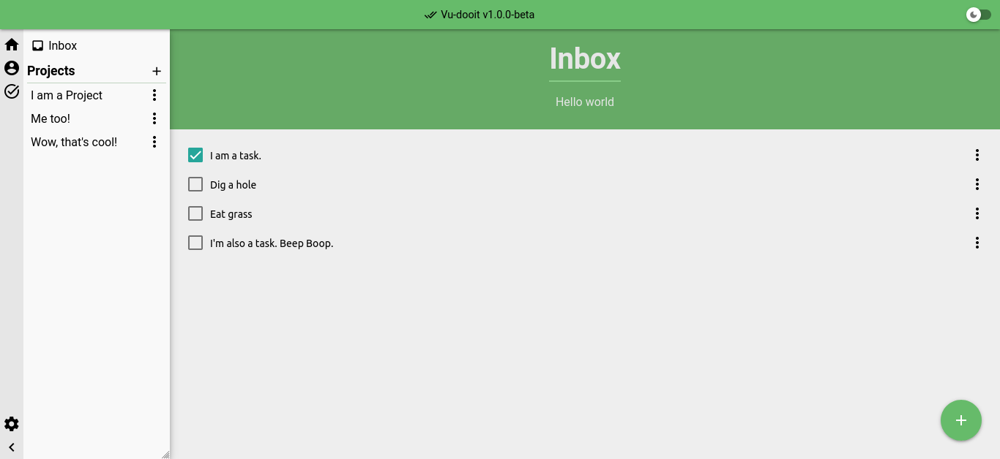
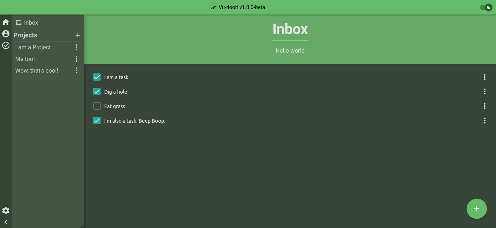

<h1 align="center">Vu-dooit</h1>
<p align="center">An open source and cross-platform Task Manager, completely offline.





## Features

- No tracking or anything similar.
- All your data is stored locally, through Indexeddb.
- A nice (?) dark mode
- Create multiple projects, organize your tasks.

## Instalation

---

## Contributing

### Install the dependencies

```bash
yarn
# or
npm install
```

### Start the app in development mode (hot-code reloading, error reporting, etc.)

```bash
# to open on browser:
quasar dev
# or with Electron:
quasar dev -m electron
```

### Lint the files

```bash
yarn lint
# or
npm run lint
```

### Format the files

```bash
yarn format
# or
npm run format
```

### Build the app for production

```bash
quasar build
```

### Customize the configuration

See [Configuring quasar.config.js](https://v2.quasar.dev/quasar-cli-vite/quasar-config-js).
